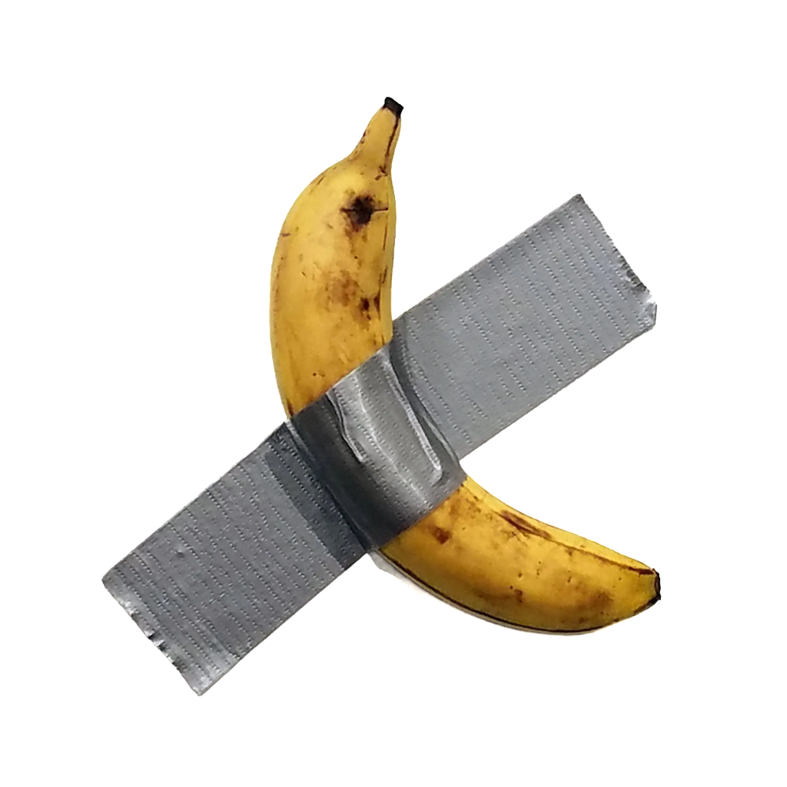

# 🌀 TouchDesigner Fundamentals Workshop



## 🎯 Overview

Welcome to the **TouchDesigner Fundamentals Workshop**, a **3-day hands-on learning experience** designed to introduce beginners to the world of **real-time visuals, generative art, and interactive media**. This course is inspired by the [TouchDesigner 100 Series](https://learn.derivative.ca/courses/100-fundamentals/) and will guide you through the essentials of **node-based programming, 3D rendering, interactivity, and Python scripting**.

## 📅 Workshop Structure

### [Day 1: Introduction & Core Concepts](day01.md)

- Understanding the TouchDesigner Interface
- Working with **TOPs** (Texture Operators) for image and video processing
- Basics of compositing, masking, and effects

### [Day 2: Signal Processing & 3D Rendering](day02.md)

- Exploring **CHOPs** (Channel Operators) for signal control
- Introduction to **SOPs** (Surface Operators) and 3D geometry
- Basic lighting, cameras, and rendering techniques

### Day 3: UI, Python & Advanced Topics

- Creating interactive UI elements using **COMPs**
- Writing **Python scripts** for automation and interactivity
- Performance optimization and best practices

## 📂 Folder Structure

To help you navigate through course materials, the repository is structured as follows:

```
├── 📜 README.md        # This file
├── 📁 assets/          # Images, videos, and other media files
├── 📁 references/      # Articles, links, and additional readings
├── 📁 examples/        # Example TouchDesigner projects (.toe files)
├── 📁 exercises/       # Hands-on challenges and practice tasks
├── 📁 presentations/   # Slides and PDFs used in the workshop
└── 📁 notes/           # Summary notes and key takeaways from sessions
```

## 🎨 What You'll Learn

✅ Real-time visual programming with **TouchDesigner**  
✅ Working with **images, video, and generative visuals**  
✅ **Interactivity** using sensors, MIDI, and data inputs  
✅ **3D rendering, lighting, and materials**  
✅ Basic **Python scripting** for automation  
✅ Best practices for **performance optimization**

## 📂 Workshop Resources

- [Exercises](exercises/)
- [Examples](examples/)
- [References](references/)
- [Presentations](presentations/)

## 🚀 Get Started

1. Download and install [TouchDesigner](https://derivative.ca/download)
2. Clone this repository:
   ```
   git clone https://github.com/digitalideation/toolbox-touchdesigner.git
   ```